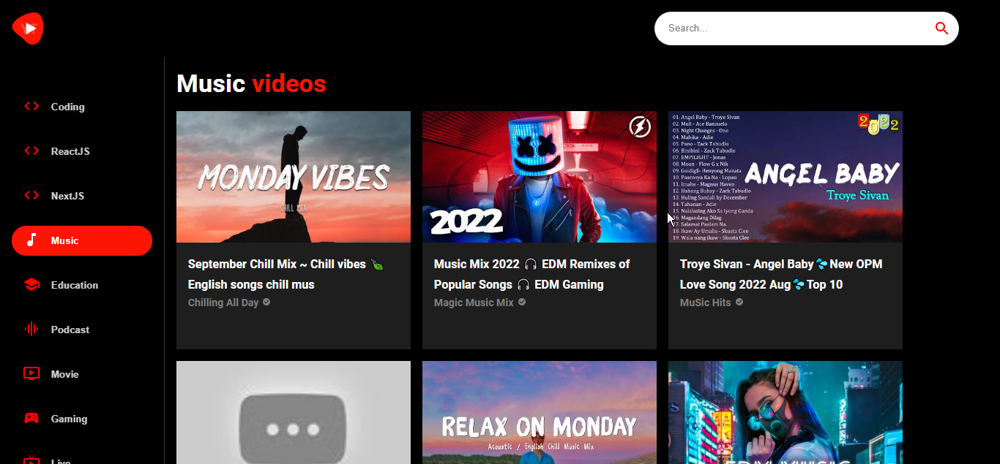

# YouTube_2.0

A clone of youtube made using react js and meterial UI. The application has the functionality of searching for channels and videos, a video detail page to play video and see the suggested videos, a channel page displaying all the details and videos of the channel and a sidebar with video categories to filter videos. A free version of Youtube api is used from the rapidAPI website which is used for fetching the data.

## Demo

Website Demo


[Youtube2.0](./demo/demo.png)



## Tech Stack

**Client:** React, TailwindCSS


## Run Locally

Clone the project

```bash
  git clone https://github.com/Vishnu-Nadh/YouTube_2.0.git

Go to the project directory

```bash
  cd YouTube_2.0
```

Install dependencies

```bash
  npm install
```

Start the server

```bash
  npm run dev
```

## Lessons Learned

- The project helped me to learn how to use API efficiently for a web applicaton using react js

- Learned about Meterial UI and its potential

- Familiared with React router v6 and learned to implement efficient routing in react application

- Mastered react component reusability

## 🚀 About Me

- Full stack developer...
- Avid Learner...


## 🔗 Links

[](https://www.linkedin.com/in/vishnunadh/)
[](https://twitter.com/_VishnuNadh_)